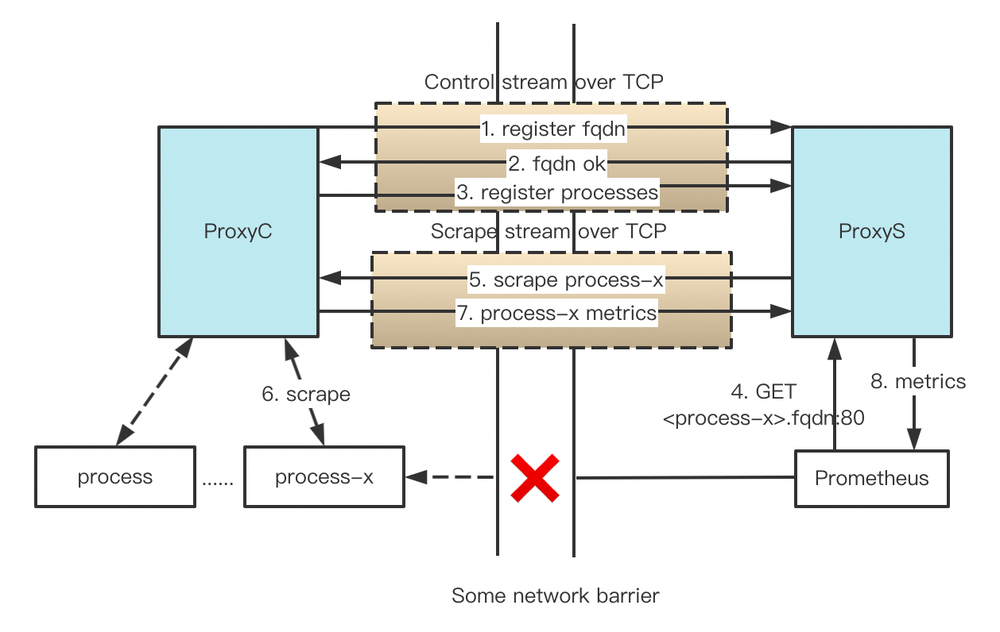

# PushProx

PushProx is a client and proxy that allows transversing of NAT and other
similar network topologies by Prometheus, while still following the pull model.

While this is reasonably robust in practice, this is a work in progress.

## About this fork
1. Replace HTTP proxy with TCP, one node one TCP connection at most
2. token auth support
3. Metrics between Proxy and Proxy Client are transported over cryptographic tunnel 
4. Process register support, process endpoints can be exported to Prometheus directly
5. Add label pairs to scraped process metric arbitrarily
6. change /clients endpoint to /targets

Star are appreciated if you like my job!

## Running

First build the proxy and client:

```
git clone https://github.com/phosae/pushprox.git
cd pushprox
make build
```

Run the proxy somewhere both Prometheus and the clients can get to:

```
./pushprox-proxy --auth.tokens=my-pwd,phosae
```

On every target machine run the client, pointing it at the proxy:
```
./pushprox-client  --fqdn client --proxy-addr 127.0.0.1:7080 --auth-token my-pwd --metrics http://127.0.0.1:8900/metrics,http://localhost:8900/metrics --label-pairs env=e2e-test,node=mac
```

## Service Discovery

The `/targets` endpoint will return a list of all registered clients in the format
used by `file_sd_configs`. You could use wget in a cronjob to put it somewhere
file\_sd\_configs can read and then then relabel as needed.

```shell
$ curl -s 127.1:8080/targets | jq
[
  {
    "targets": [
      "client:80/MTI3LjAuMC4xOjg5MDAvbWV0cmljcw=="
    ],
    "labels": null
  },
  {
    "targets": [
      "client:80/bG9jYWxob3N0Ojg5MDAvbWV0cmljcw=="
    ],
    "labels": null
  }
]
```

## Expose to Prometheus

In Prometheus, use the proxy as a `proxy_url`:

```
scrape_configs:
- job_name: node
  proxy_url: http://proxy:8080/
  static_configs:
    - targets: ['client:80/MTI3LjAuMC4xOjg5MDAvbWV0cmljcw==']  # Presuming the FQDN of the client is "client", and process HTTP endpoint is  http://127.0.0.1:8900
```

## How It Works



Clients perform scrapes in a network environment that's not directly accessible by Prometheus. 
The Proxy is accessible by both the Clients and Prometheus.
Each client(node) is identified by its fqdn.
Each process behind client is identified by its HTTP metric endpoint which encode as base64 string.

For example, the following sequence is performed when Prometheus scrapes target `process-x` via PushProx.
- First, a Client connect the Proxy over TCP with its fqdn and token for authentication, the Proxy authenticate the token present by Client and return fqdn OK to Client if success.
Client register all its processes to the Proxy. (1-3)
- Next, Prometheus tries to scrape the target with hostname `process-x` via the Proxy (4).
- Using the fqdn received in (1-3),  the Proxy now routes the scrape to the correct Client with process name(default base64 encoded metric endpoint) (5).
- With the received process name, the client execute scrape request on the correct Process (6), the response containing metrics is return to the Proxy (7). 
- On its turn, the Proxy returns this to Prometheus (8) as a reponse to the initial scrape of (4).

PushProx passes all HTTP headers transparently, features like compression and accept encoding are up to the scraping Prometheus server.

## Security

Token authentication and authorization is included, the proxy firstly validate the token of client, then all traffic will transport over cryptographic tunnel.
